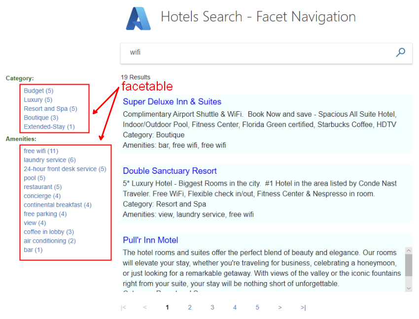
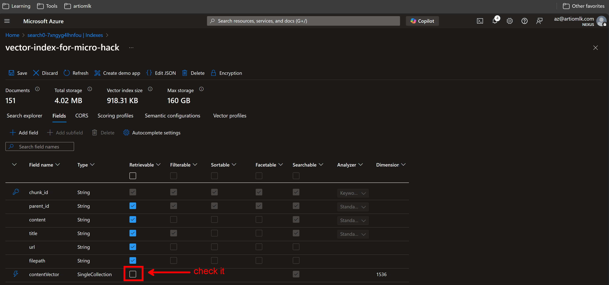

# Challenge 2: Indexing Data

## Table of Contents

- [Challenge 2: Indexing Data](#challenge-2-indexing-data)
  - [Table of Contents](#table-of-contents)
  - [Vector Index](#vector-index)
    - [Vector Index Examples](#vector-index-examples)
  - [Euclidean Distance](#euclidean-distance)
    - [Euclidean Distance Example](#euclidean-distance-example)
  - [Cosine Similarity](#cosine-similarity)
    - [Cosine Similarity Example](#cosine-similarity-example)
  - [Difference Between Euclidean Distance and Cosine Similarity](#difference-between-euclidean-distance-and-cosine-similarity)
    - [Cosine Similarity Difference](#cosine-similarity-difference)
    - [Euclidean Distance Difference](#euclidean-distance-difference)
    - [Example Comparison Euclidean Distance vs Cosine Similarity](#example-comparison-euclidean-distance-vs-cosine-similarity)
      - [Euclidean Distance Example Comparison](#euclidean-distance-example-comparison)
      - [Cosine Similarity Example Comparison](#cosine-similarity-example-comparison)
  - [Data Chunking](#data-chunking)
    - [Benefits of Data Chunking](#benefits-of-data-chunking)
  - [Natural Language Processing (NLP)](#natural-language-processing-nlp)
    - [NLP Examples](#nlp-examples)
  - [Search Types](#search-types)
    - [Example Use Cases](#example-use-cases)
  - [AI Search Index Field Categories](#ai-search-index-field-categories)
    - [Retrievable](#retrievable)
    - [Filterable](#filterable)
    - [Facetable](#facetable)
    - [Sortable](#sortable)
    - [Searchable](#searchable)
    - [Analyzer](#analyzer)
    - [Dimension](#dimension)
  - [Troubleshooting](#troubleshooting)

## Vector Index

A vector index is a data structure that allows for efficient similarity search in high-dimensional spaces. It is commonly used in machine learning and information retrieval to find the closest vectors to a given query vector. The vectors are typically representations of data points in a continuous vector space, and the index enables fast retrieval of vectors that are similar to the query based on a chosen distance metric, such as Euclidean distance or cosine similarity.

Vector conversions are one-way: text-to-vector. There's no vector-to-text conversion for queries or results (for example, you can't convert a vector result to a human readable string).

### Vector Index Examples

1. **Image Retrieval**: In an image search engine, images are converted into feature vectors using a neural network. A vector index is then used to quickly find images that are similar to a query image.

2. **Document Search**: In a document retrieval system, documents are represented as vectors in a high-dimensional space. A vector index helps in finding documents that are most relevant to a search query based on their vector representations.

3. **Recommendation Systems**: In recommendation systems, user preferences and item features are represented as vectors. A vector index can be used to find items that are similar to those a user has liked in the past.

## Euclidean Distance

Euclidean distance is a measure of the straight-line distance between two points in a Euclidean space. In the context of a vector index, it is used to determine the similarity between vectors by calculating the distance between them.

### Euclidean Distance Example

Consider two vectors, A and B, in a 2-dimensional space:

- Vector A: (2, 3)
- Vector B: (5, 7)

The Euclidean distance between A and B is calculated as follows:

$$ \text{Distance} = \sqrt{(x_2 - x_1)^2 + (y_2 - y_1)^2} $$

Substituting the values:

$$ \text{Distance} = \sqrt{(5 - 2)^2 + (7 - 3)^2} $$
$$ \text{Distance} = \sqrt{3^2 + 4^2} $$
$$ \text{Distance} = \sqrt{9 + 16} $$
$$ \text{Distance} = \sqrt{25} $$
$$ \text{Distance} = 5 $$

In this example, the Euclidean distance between vectors A and B is 5. This distance can be used to determine how similar or different the two vectors are in the vector index.

## Cosine Similarity

Cosine similarity is a measure of similarity between two non-zero vectors of an inner product space. It is defined as the cosine of the angle between the two vectors, which is also the dot product of the vectors divided by the product of their magnitudes.

### Cosine Similarity Example

Consider two vectors, A and B, in a 3-dimensional space:

- Vector A: (1, 2, 3)
- Vector B: (4, 5, 6)

The cosine similarity between A and B is calculated as follows:

$$ \text{Cosine Similarity} = \frac{A \cdot B}{\|A\| \|B\|} $$

Where:

$$
A \cdot B \text{ is the dot product of } A \text{ and } B
$$

$$
\|A\| \text{ is the magnitude of } A
$$

$$
\|B\| \text{ is the magnitude of } B
$$

Calculating the dot product:

$$ A \cdot B = (1 \cdot 4) + (2 \cdot 5) + (3 \cdot 6) = 4 + 10 + 18 = 32 $$

Calculating the magnitudes:

$$ \|A\| = \sqrt{1^2 + 2^2 + 3^2} = \sqrt{1 + 4 + 9} = \sqrt{14} $$
$$ \|B\| = \sqrt{4^2 + 5^2 + 6^2} = \sqrt{16 + 25 + 36} = \sqrt{77} $$

Substituting the values:

$$ \text{Cosine Similarity} = \frac{32}{\sqrt{14} \cdot \sqrt{77}} = \frac{32}{\sqrt{1078}} \approx 0.97 $$

In this example, the cosine similarity between vectors A and B is approximately 0.97, indicating a high degree of similarity.

## Difference Between Euclidean Distance and Cosine Similarity

While both cosine similarity and Euclidean distance involve vector magnitudes, they measure different aspects of the vectors.

### Cosine Similarity Difference

This measures the cosine of the angle between two vectors. It focuses on the direction of the vectors rather than their magnitude. The formula is:

$$ \text{Cosine Similarity} = \frac{\mathbf{A} \cdot \mathbf{B}}{\|\mathbf{A}\| \|\mathbf{B}\|} $$

where:

$$
\mathbf{A} \cdot \mathbf{B} \text{ is the dot product of the vectors}
$$

$$
\|\mathbf{A}\| \text{ and } \|\mathbf{B}\| \text{ are their magnitudes}
$$

### Euclidean Distance Difference

This measures the straight-line distance between two points in space. It takes into account the magnitude of the difference between the vectors. The formula is:

$$  \text{Euclidean Distance} = \sqrt{\sum_{i=1}^{n} (A_i - B_i)^2}  $$

### Example Comparison Euclidean Distance vs Cosine Similarity

Consider two vectors, A and B, in a 2-dimensional space:

- Vector A: (1, 0)
- Vector B: (0, 1)

#### Euclidean Distance Example Comparison

The Euclidean distance between A and B is calculated as follows:

$$ \text{Distance} = \sqrt{(0 - 1)^2 + (1 - 0)^2} = \sqrt{1 + 1} = \sqrt{2} \approx 1.41 $$

#### Cosine Similarity Example Comparison

The cosine similarity between A and B is calculated as follows:

$$ \text{Cosine Similarity} = \frac{(1 \cdot 0) + (0 \cdot 1)}{\sqrt{1^2 + 0^2} \cdot \sqrt{0^2 + 1^2}} = \frac{0}{1 \cdot 1} = 0 $$

In this example, the Euclidean distance between vectors A and B is approximately 1.41, indicating they are not close in terms of distance. However, the cosine similarity is 0, indicating they are orthogonal (at a 90-degree angle) and thus completely dissimilar in direction.

## Data Chunking

Data chunking is the process of breaking down large datasets into smaller, more manageable pieces or "chunks." This technique is particularly useful in scenarios where processing the entire dataset at once is impractical due to memory constraints or when parallel processing can significantly speed up computations.

### Benefits of Data Chunking

1. **Memory Efficiency**: By processing smaller chunks of data, systems can handle larger datasets without running out of memory.
2. **Parallel Processing**: Chunks can be processed in parallel, leading to faster overall processing times.
3. **Fault Tolerance**: If a chunk fails to process, only that chunk needs to be reprocessed, not the entire dataset.
4. **Scalability**: Systems can scale more effectively by distributing chunks across multiple nodes or machines.

## Natural Language Processing (NLP)

Natural Language Processing (NLP) is a field of artificial intelligence that focuses on the interaction between computers and humans through natural language. The goal of NLP is to enable computers to understand, interpret, and generate human language in a way that is both meaningful and useful.

### NLP Examples

1. **Sentiment Analysis**: Analyzing customer reviews to determine whether the sentiment is positive, negative, or neutral. This helps businesses understand customer opinions and improve their products or services.

2. **Machine Translation**: Translating text from one language to another using models like Google Translate. This allows for communication across different languages and helps in breaking language barriers.

3. **Chatbots**: Developing conversational agents that can understand and respond to user queries in natural language. Chatbots are widely used in customer service to provide instant support and information.

4. **Text Summarization**: Automatically generating a concise summary of a long document. This is useful for quickly understanding the main points of a large amount of text without reading it in its entirety.

## Search Types

When using AI to search your data, there are different types of searches you can perform, each suited to different needs and scenarios:

1. **Keyword Search**: This is the traditional search method where the search engine looks for exact matches of the query keywords in the documents. It is fast and straightforward but may miss relevant documents that use different terminology.

   **Example**: Searching for the term "machine learning" in a database of research papers will return documents that contain the exact phrase "machine learning."

2. **Semantic Search**: This type of search goes beyond keyword matching by understanding the meaning behind the query and the documents. It uses natural language processing (NLP) to find documents that are contextually relevant, even if they don't contain the exact keywords.

   **Example**: Searching for "AI in healthcare" might return documents discussing "artificial intelligence applications in medical diagnostics" even if the exact phrase "AI in healthcare" is not present.

3. **Vector Search**: In vector search, both the query and the documents are converted into high-dimensional vectors. The search engine then finds documents with vectors that are closest to the query vector, based on a similarity metric like cosine similarity or Euclidean distance. This method is particularly effective for finding similar items in large datasets.

   **Example**: In an e-commerce platform, searching for "red shoes" will return products that are similar in style and color to the query, even if the exact words "red shoes" are not in the product description.

4. **Hybrid Search**: This combines multiple search techniques, such as keyword and semantic search, to leverage the strengths of each method. Hybrid search can provide more accurate and comprehensive results by considering both exact matches and contextual relevance.

   **Example**: In a customer support system, a hybrid search might use keyword search to find exact matches for error codes and semantic search to find relevant troubleshooting guides based on the context of the user's issue.

5. **Hybrid (Vector + Keyword) Search**: This search type combines vector search and keyword search. The system first performs a vector search to find similar items and then refines the results using keyword search to ensure exact matches for specific terms.

   **Example**: In a music recommendation system, a vector search might first find songs similar to a user's favorite track, and then a keyword search could refine the results to include only songs with specific genres or artists.

6. **Hybrid (Vector + Keyword + Semantic) Search**: This advanced hybrid search combines vector, keyword, and semantic search techniques. The system first performs a vector search to find similar items, then uses keyword search to ensure exact matches, and finally applies semantic search to include contextually relevant results.

   **Example**: In a legal document search system, a vector search might first find documents similar to a query, a keyword search could refine the results to include specific legal terms, and a semantic search could ensure the documents are contextually relevant to the legal issue at hand.

### Example Use Cases

- **Keyword Search**: Suitable for scenarios where precise matches are required, such as searching for specific terms in a legal document.
- **Semantic Search**: Ideal for finding contextually relevant information, such as retrieving articles related to a specific topic.
  - Searching for "What is the capital of France?" would return results related to Paris, understanding the context of the question.
- **Vector Search**: Useful in recommendation systems and similarity searches, such as finding similar products in an e-commerce platform.
  - Searching for a document similar to a given document would return documents that have similar content based on their vector representations.
- **Hybrid Search**: Effective in complex search applications where both exact matches and contextual understanding are important, such as customer support systems.
- **Hybrid (Vector + Keyword) Search**: Useful in scenarios where similarity and exact keyword matches are both important, such as music or movie recommendations.
- **Hybrid (Vector + Keyword + Semantic) Search**: Ideal for complex search applications requiring similarity, exact matches, and contextual relevance, such as legal or medical document searches.

## AI Search Index Field Categories

When defining fields in an AI search index, it's important to understand the different categories and their purposes. Here are the main field categories:

### Retrievable

**Definition**: Fields marked as retrievable can be included in the search results.

**Example**: If you have a document with fields like `title`, `author`, and `content`, you might mark `title` and `author` as retrievable.

**Use Case**: Use retrievable fields when you want to display specific information in the search results. For example, in a book search application, you might retrieve the `title` and `author` fields to show in the search results list.

### Filterable

**Definition**: Fields marked as filterable can be used to filter search results based on specific criteria.

**Example**: If you have a product catalog with fields like `price`, `category`, and `brand`, you might mark `price` and `category` as filterable.

**Use Case**: Use filterable fields to narrow down search results. For example, in an e-commerce site, you might filter products by `price` range or `category` to help users find what they are looking for.

### Facetable

**Definition**: Fields marked as facetable can be used to create facets, which are categories that help users refine their search results.

**Example**: If you have a movie database with fields like `genre`, `year`, and `rating`, you might mark `genre` and `year` as facetable.

**Use Case**: Use facetable fields to provide users with options to refine their search. For example, in a movie search application, you might create facets for `genre` and `year` to help users filter movies by these categories.

**Difference from Filterable**: While both facetable and filterable fields allow users to narrow down search results, facetable fields provide a more user-friendly way to explore and refine search results by presenting categories and counts. Filterable fields, on the other hand, are used for more precise filtering based on specific criteria.

### Sortable

**Definition**: Fields marked as sortable can be used to sort search results in ascending or descending order.

**Example**: If you have a news article index with fields like `publish_date` and `title`, you might mark `publish_date` as sortable.

**Use Case**: Use sortable fields to order search results. For example, in a news website, you might sort articles by `publish_date` to show the most recent articles first.

### Searchable

**Definition**: Fields marked as searchable can be searched using full-text search.

**Example**: If you have a blog post index with fields like `title`, `content`, and `tags`, you might mark `title` and `content` as searchable.

**Use Case**: Use searchable fields to enable full-text search. For example, in a blog search application, you might search the `title` and `content` fields to find posts that match the user's query.

### Analyzer

**Definition**: An analyzer is used to process text fields during indexing and querying. It defines how the text is tokenized and normalized.

**Example**: If you have a text field `content`, you might use a standard analyzer to tokenize the text into words and convert them to lowercase.

**Use Case**: Use analyzers to control how text is processed. For example, in a search application, you might use a custom analyzer to handle specific tokenization and normalization rules for different languages.

### Dimension

**Definition**: Fields marked as dimensions are used in vector search to represent high-dimensional vectors.

**Example**: If you have an image search index, you might have a field `image_vector` that stores the vector representation of the image.

**Use Case**: Use dimension fields for vector search. For example, in an image search application, you might use the `image_vector` field to find images that are similar to a query image based on their vector representations.

## Troubleshooting

- Failed to use Azure Open AI API Data access key due to storage has disabled shared access keys.
  - 
  - 
- Can't retrieve vectors in search queries.
  - 
