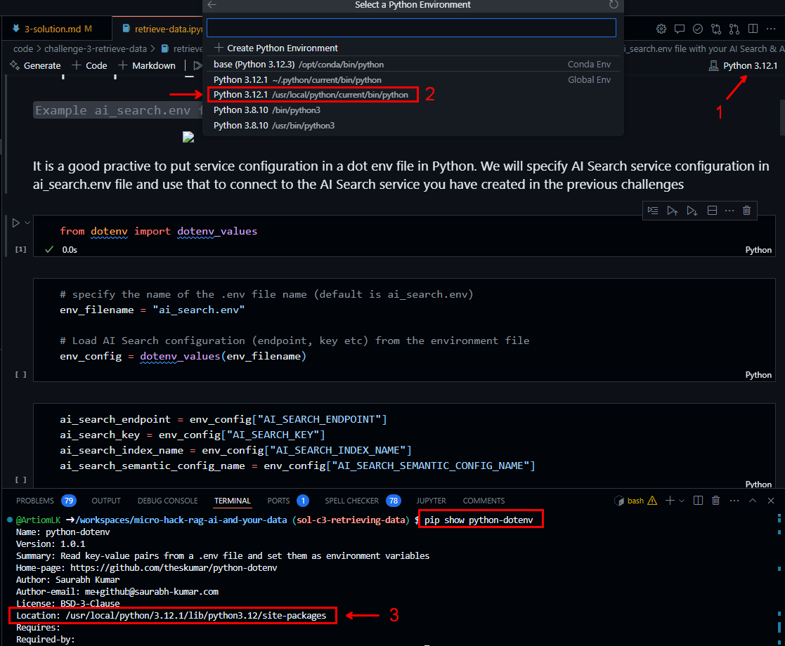

# Challenge 3: Retrieving Data

## Table of Contents

- [Challenge 3: Retrieving Data](#challenge-3-retrieving-data)
  - [Table of Contents](#table-of-contents)
    - [Solution](#solution)
  - [Reciprocal Rank Fusion (RRF)](#reciprocal-rank-fusion-rrf)
    - [How RRF Works](#how-rrf-works)
    - [Example](#example)
  - [Troubleshoot](#troubleshoot)

### Solution

```bash
pip install azure-search-documents
pip install openai

pip install python-dotenv # optional
pip show python-dotenv

# Select the correct kernel, check troubleshooting section if needed
# update code/challenge-3-retrieve-data/ai_search.env
# Complete the instructions in the code/challenge-3-retrieve-data/retrieve-data.ipynb
```

## Reciprocal Rank Fusion (RRF)

Reciprocal Rank Fusion (RRF) is an ensemble method used in information retrieval to combine the results from multiple ranking algorithms. The idea is to leverage the strengths of different ranking methods to produce a more accurate and robust final ranking.

### How RRF Works

RRF assigns a score to each document based on its rank in each individual ranking list. The score for a document \(d\) is calculated using the formula:

$$
\text{RRF}(d) = \sum_{i=1}^{n} \frac{1}{k + r_i(d)}
$$

where:

- \(n\) is the number of ranking lists,
- \(r_i(d)\) is the rank of document \(d\) in the \(i\)-th ranking list,
- \(k\) is a constant (usually set to 60) to avoid division by zero and to control the influence of lower-ranked documents.

### Example

Consider three ranking lists from different algorithms:

- List 1: [A, B, C, D]
- List 2: [B, D, A, C]
- List 3: [C, A, B, D]

Using RRF with \(k = 60\):

- Document A:

$$
\frac{1}{60+1} + \frac{1}{60+3} + \frac{1}{60+2} = \frac{1}{61} + \frac{1}{63} + \frac{1}{62} \approx 0.0164
$$

- Document B:

$$
\frac{1}{60+2} + \frac{1}{60+1} + \frac{1}{60+3} = \frac{1}{62} + \frac{1}{61} + \frac{1}{63} \approx 0.0163
$$

- Document C:

$$
\frac{1}{60+3} + \frac{1}{60+4} + \frac{1}{60+1} = \frac{1}{63} + \frac{1}{64} + \frac{1}{61} \approx 0.0158
$$

- Document D:

$$
\frac{1}{60+4} + \frac{1}{60+2} + \frac{1}{60+4} = \frac{1}{64} + \frac{1}{62} + \frac{1}{64} \approx 0.0156
$$

Final ranking based on RRF scores: A, B, C, D

## Troubleshoot

- Change Python Kernel
  - 
