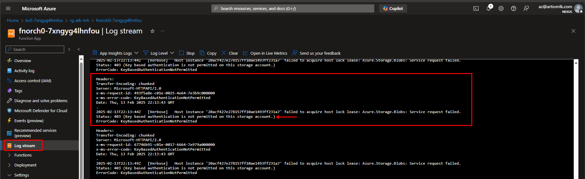
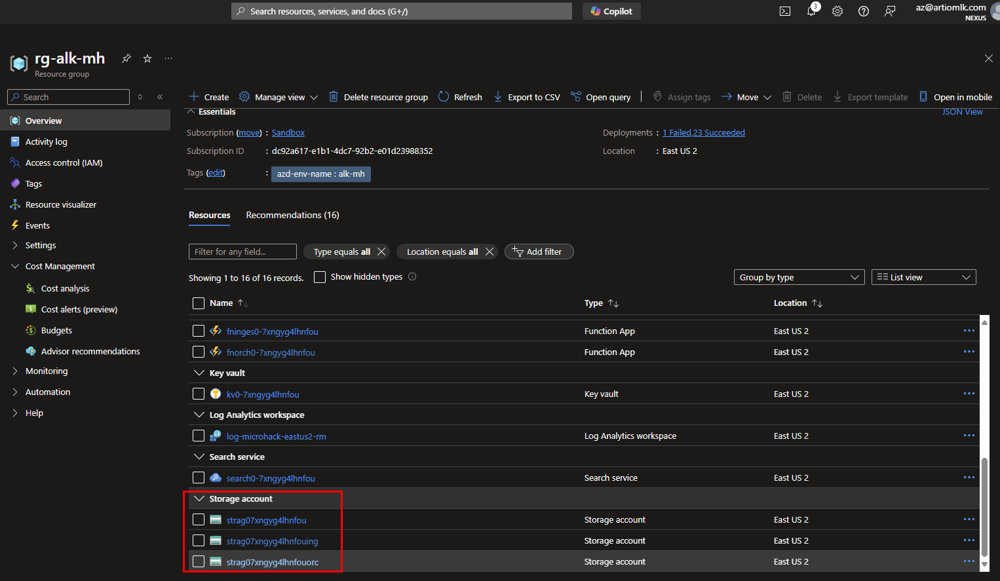

# Challenge 4: Integrating RAG with Application

## Table of Contents

- [Challenge 4: Integrating RAG with Application](#challenge-4-integrating-rag-with-application)
  - [Table of Contents](#table-of-contents)
    - [Solution](#solution)
  - [Troubleshoot](#troubleshoot)

### Solution

```bash
# -------------------------------------------------------------------------------------------------
# Init Variables
tenant_id="########-####-####-####-############";                         echo $tenant_id
sub_id="########-####-####-####-############";                            echo $sub_id

resource_token="7xngyg4lhnfou";                                           echo $resource_token
func_n="fnorch0-$resource_token";                                         echo $func_n
rg_n="rg-alk-mh";                                                         echo $rg_n

# kv variables
kv_n="kv0-$resource_token";                                               echo $kv_n
srch_k="####################################################";            echo $srch_k

# srch variables
srch_n="search0-$resource_token";                                         echo $srch_n

# -------------------------------------------------------------------------------------------------
# Login to Azure Portal
az login --use-device-code --tenant $tenant_id
az account set --subscription $sub_id
az account show

# -------------------------------------------------------------------------------------------------
# Update Function App Environment Variables (MAKE SURE TO UPDATE THE 4.edit_func_app_settings.json FILE)

az functionapp config appsettings list \
--name $func_n \
--resource-group $rg_n > ./solutions/4.current_func_settings.json

jq -s '.[0] + .[1]' ./solutions/4.current_func_settings.json ./solutions/4.edit_func_app_settings.json > ./solutions/4.merged_settings.json

az functionapp config appsettings set \
--name $func_n \
--resource-group $rg_n \
--settings @./solutions/4.merged_settings.json

# -------------------------------------------------------------------------------------------------
# Create Secrets on the Key Vault

az keyvault secret set \
--vault-name $kv_n \
--name "azureSearchKey" \
--content-type "string" \
--value $srch_k

az keyvault secret recover --vault-name $kv_n --name "azureSearchKey"

# -------------------------------------------------------------------------------------------------
# Assign the func rbac Search Index Data Contributor and Search Service Contributor on the the srch service

az role assignment create \
--role "Search Index Data Contributor" \
--assignee-object-id $(az functionapp show --name $func_n --resource-group $rg_n --query 'identity.principalId' -o tsv) \
--scope "/subscriptions/$sub_id/resourceGroups/$rg_n/providers/Microsoft.Search/searchServices/$srch_n"

az role assignment create \
--role "Search Service Contributor" \
--assignee-object-id $(az functionapp show --name $func_n --resource-group $rg_n --query 'identity.principalId' -o tsv) \
--scope "/subscriptions/$sub_id/resourceGroups/$rg_n/providers/Microsoft.Search/searchServices/$srch_n"

# -------------------------------------------------------------------------------------------------
# Update the Function App Code
cd code/gpt-rag-orchestrator
func azure functionapp list-functions $func_n
func azure functionapp publish $func_n --python

# To review any errors, review orc function app features such as:
# Invocations
# Logs
# Func/Monitor/App Insights
# Func/Log Stream to see other errors
# Func/Deployment/Deployment Center/Logs if you push changes
```

## Troubleshoot

- Status: 403 (Key based authentication is not permitted on this storage account.) from function App
  - 
  - 
  - 
- [Review semantic-kernel code examples](https://github.com/search?q=repo%3Amicrosoft%2Fsemantic-kernel%20path%3A%2F%5Epython%5C%2Fsamples%5C%2Fconcepts%5C%2F%2F%20KernelArguments&type=code)
